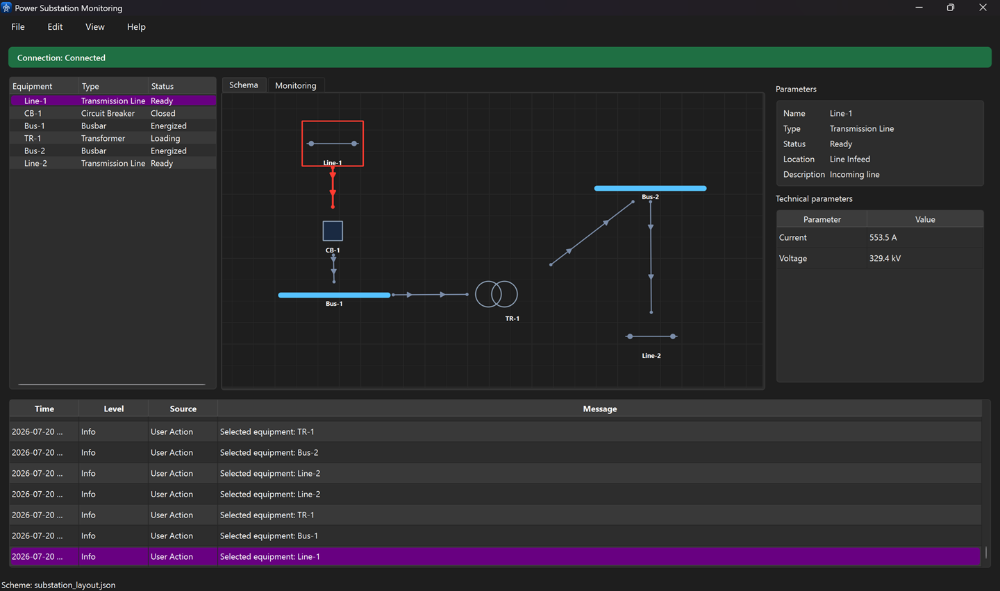
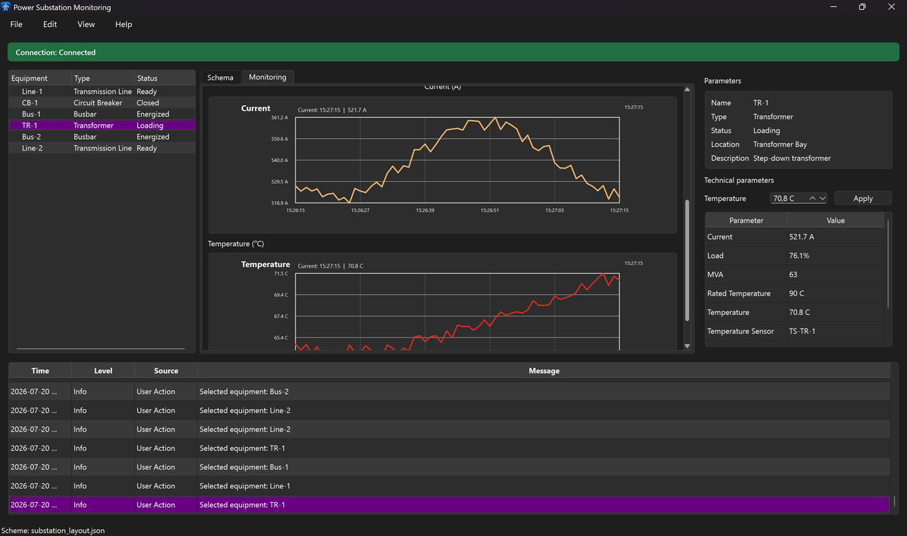

# Power Substation Monitoring

Програма для моніторингу електричної підстанції. У програмі доступні схема обладнання, телеметрія, графіки параметрів, журнал подій, звіти та налаштування теми й мови.

## Вигляд програми

### Головне вікно



### Моніторинг



## Можливості

- перегляд схеми підстанції та обладнання;
- моніторинг напруги, струму й температури;
- графіки за хвилину, годину, день та інший вибраний період;
- керування станом вимикача `CB-1`;
- зміна температури трансформатора з плавним поверненням до норми;
- журнал подій із попередженнями та критичними повідомленнями;
- експорт звітів у PDF або TXT;
- збереження історії між запусками;
- світла, темна та системна теми;
- англійська й українська мови;
- завантаження, редагування та збереження схем у JSON.

## Системні вимоги

- Windows 10 або новіша версія;
- Qt 6.5 або новіша версія з компонентами `Core`, `Widgets`, `Svg` і `PrintSupport`;
- CMake 3.19 або новіша версія;
- Python 3 для генерації стилів Breeze;
- Git та доступ до Інтернету під час першого налаштування проекту.

## Залежності

Qt встановлюється через Qt Online Installer. Для збірки підходить комплект на зразок `Desktop Qt 6.x.x MinGW 64-bit`.

CMake, Python 3 і Git мають бути доступними через системну змінну `PATH` або налаштовані у Qt Creator.

Під час першого налаштування CMake автоматично завантажує `BreezeStyleSheets` з GitHub і генерує ресурси тем.

## Збірка через Qt Creator

У Qt Creator використовується такий порядок:

1. Відкриття файлу `CMakeLists.txt`.
2. Налаштування комплекту Qt 6 для Desktop.
3. Налаштування конфігурації `Debug` або `Release`.
4. Виконання **Configure Project**.
5. Виконання **Build**.
6. Запуск через **Run**.

Якщо Qt Creator не знаходить CMake або Python, їхні шляхи потрібно додати в налаштування Kit або системну змінну `PATH`.

## Збірка через PowerShell

Команди виконуються з кореневої директорії проекту. Замість `<шлях-до-проекту>` використовується фактичний шлях до цієї директорії.

```powershell
cd <шлях-до-проекту>
cmake -S . -B build
cmake --build build --parallel
```

Після успішної збірки виконуваний файл знаходиться у відповідній піддиректорії `build`, наприклад:

```text
build\Desktop_Qt_6_10_1_MinGW_64_bit-Debug\PowerSubstationMonitoring.exe
```

Запуск з PowerShell:

```powershell
& .\build\Desktop_Qt_6_10_1_MinGW_64_bit-Debug\PowerSubstationMonitoring.exe
```

Назва build-директорії залежить від вибраного генератора та комплекту Qt.

## Offline-збірка

Якщо `BreezeStyleSheets` уже завантажений у `build/_deps`, повторне підключення до GitHub не потрібне:

```powershell
cmake -S . -B build -DFETCHCONTENT_FULLY_DISCONNECTED=ON
cmake --build build --parallel
```

Offline-режим працює лише за наявності локальної копії BreezeStyleSheets.

## Робота зі схемами

Готові схеми зберігаються в директорії `data`:

- `substation_layout.json` — основна схема;
- `substation_layout_ring.json` — схема з резервною гілкою;
- `substation_layout_compact.json` — компактна схема.

### Відкриття схеми

Для відкриття JSON-файлу використовується меню **File -> Load**, після чого у файловому діалозі потрібен файл схеми.

Назва відкритого файлу відображається у рядку стану програми.

### Редагування схеми

Обладнання можна перетягувати мишкою. З’єднання автоматично переміщуються разом із вузлами, а точки підключення перераховуються за положеннями обладнання.

### Збереження схеми

- **File -> Save** зберігає поточні позиції у відкритий JSON-файл;
- **File -> Save as** створює окремий JSON-файл.

## Налаштування

У меню **Edit -> Settings** доступні:

- системна, світла або темна тема;
- English або Ukrainian;

Обрані налаштування зберігаються між запусками програми.

## Типові проблеми

### CMake не знаходить Qt

Потрібен правильний Qt Kit і коректний шлях до Qt у налаштуваннях CMake або Qt Creator.

### Не знаходиться Python

Стан Python можна перевірити командою:

```powershell
python --version
```

Якщо команда недоступна, Python потрібно встановити або додати його до `PATH`.

### Не завантажується BreezeStyleSheets

Для першого налаштування потрібен доступ до GitHub. Причиною помилки може бути відсутнє підключення до Інтернету або обмеження мережі.

За наявності локальної копії BreezeStyleSheets використовується offline-збірка, описана вище.

### Програма не запускається після збірки

Потрібно перевірити, що запускається файл із тієї самої конфігурації, яка була зібрана: `Debug` або `Release`.

## Структура проекту

- `mainwindow.*` — головне вікно програми;
- `settingsdialog.*` — налаштування теми та мови;
- `substationdiagramview.*` — графічна схема підстанції;
- `substationlayout.*` — завантаження та збереження JSON-схем;
- `telemetryservice.*` — джерело телеметричних даних;
- `telemetryhistory.*` — історія вимірювань;
- `reportdialog.*` — формування звітів;
- `data/*.json` — готові схеми підстанції;
- `resources.qrc` — ресурси програми та переклади.
